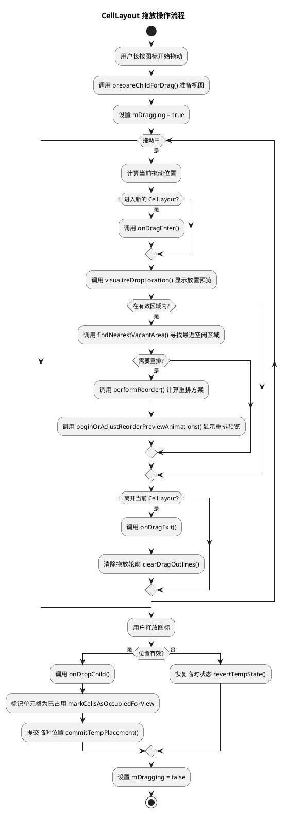
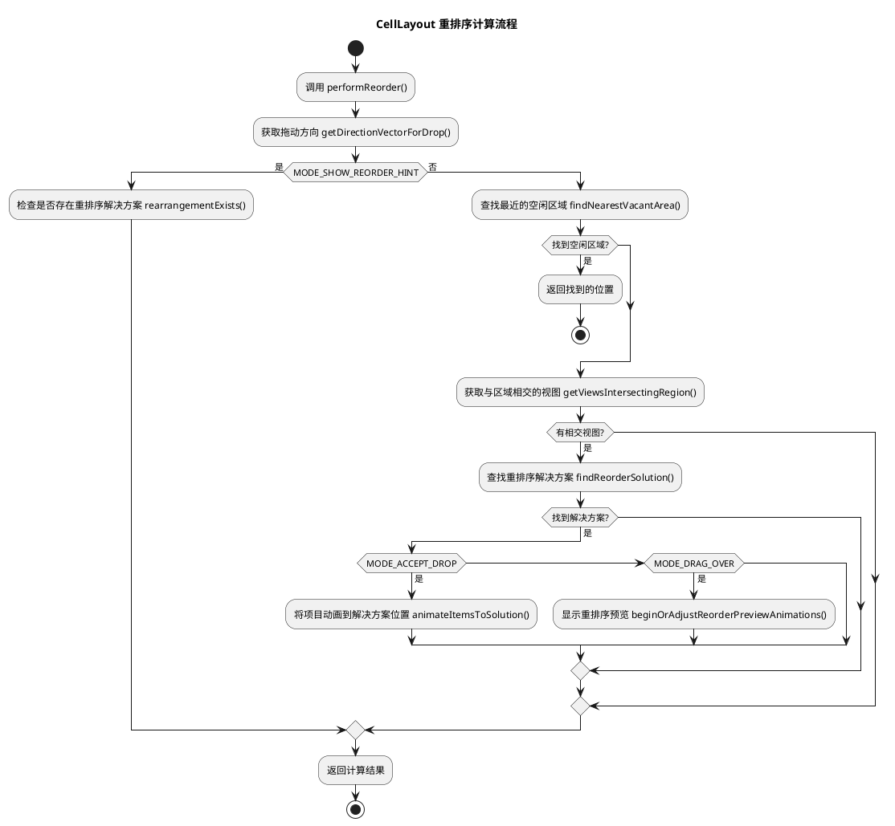

# Launcher3 CellLayout 架构分析

## 概述

CellLayout 是 Android Launcher3 系统中的核心组件，它是一个继承自 ViewGroup 的自定义布局类，主要负责在主屏幕（Workspace）和文件夹（Folder）中管理应用图标和小部件的网格布局。它实现了 BubbleTextShadowHandler 接口，为气泡文本提供阴影处理功能。

CellLayout 的主要职责包括：
- 管理网格系统（grid system）以放置应用图标和小部件
- 处理拖放操作（drag and drop）
- 实现项目重新排序（reorder）
- 处理视图的动画和视觉反馈

## 核心组件和架构

### 属性与数据结构

1. **网格属性**
   - `mCountX`/`mCountY`: 网格的列数和行数
   - `mCellWidth`/`mCellHeight`: 单元格的宽度和高度
   - `mWidthGap`/`mHeightGap`: 单元格之间的水平和垂直间距

2. **占用跟踪**
   - `mOccupied`: GridOccupancy 类型，跟踪哪些单元格被占用
   - `mTmpOccupied`: 临时网格占用状态，用于拖放操作计算

3. **视图管理**
   - `mShortcutsAndWidgets`: ShortcutAndWidgetContainer 容器，实际存放图标和小部件的容器
   - `mIntersectingViews`: 存储与拖放区域相交的视图列表

4. **拖放状态**
   - `mDropPending`: 表示是否有待处理的放置操作
   - `mDragging`: 表示是否正在进行拖动操作
   - `mDragCell`: 当前拖动项的目标单元格坐标
   - `mIsDragOverlapping`: 表示拖动区域是否与现有项重叠

### 关键内部类

1. **LayoutParams**
   - 自定义 LayoutParams 扩展了 ViewGroup.MarginLayoutParams
   - 包含 cellX, cellY, cellHSpan, cellVSpan 等字段，用于指定项目在网格中的位置和跨度
   - 包含 tmpCellX, tmpCellY, useTmpCoords 等临时字段，用于处理拖放操作过程中的临时位置

2. **ItemConfiguration**
   - 用于计算项目重排的配置
   - 存储视图到单元格位置和跨度的映射
   - 提供保存和恢复布局状态的功能

3. **ReorderPreviewAnimation**
   - 处理项目重排过程中的动画效果
   - 支持提示(HINT)和预览(PREVIEW)两种模式

4. **ViewCluster**
   - 管理一组需要一起移动的视图
   - 计算视图群组的边界和边缘

## 关键流程

### 初始化流程

1. 构造函数中初始化各种属性和对象
2. 设置网格尺寸和单元格维度
3. 创建 ShortcutAndWidgetContainer 作为子视图的容器

### 布局流程

1. `onMeasure`: 计算 CellLayout 的尺寸
2. `onLayout`: 安排 ShortcutAndWidgetContainer 的位置
3. `addViewToCellLayout`: 将视图添加到指定的单元格
4. `markCellsAsOccupiedForView`: 标记视图占用的单元格

### 拖放流程

1. `visualizeDropLocation`: 可视化拖放位置
2. `findNearestVacantArea`: 寻找最近的空闲区域
3. `onDragEnter`/`onDragExit`: 处理拖动进入和离开事件
4. `onDropChild`: 处理子视图的放置

### 重排序流程

1. `performReorder`: 执行重排序操作
2. `findReorderSolution`: 寻找重排序解决方案
3. `animateItemsToSolution`: 将项目动画到新的位置
4. `commitTempPlacement`: 提交临时位置

## 流程图

### 拖放操作流程



### 重排序计算流程



## 关键实现机制

### 网格管理系统

CellLayout 使用二维网格系统管理视图的放置。每个视图占据一个或多个单元格，通过 LayoutParams 中的 cellX, cellY, cellHSpan, cellVSpan 来标识位置和跨度。

```java
public class LayoutParams extends ViewGroup.MarginLayoutParams {
    public int cellX;           // 单元格X坐标
    public int cellY;           // 单元格Y坐标
    public int cellHSpan;       // 水平跨度
    public int cellVSpan;       // 垂直跨度
    
    // 临时坐标，用于拖放操作
    public int tmpCellX;
    public int tmpCellY;
    public boolean useTmpCoords;
    
    // 其他属性...
}
```

### 拖放处理机制

CellLayout 实现了复杂的拖放处理机制，包括：

1. **可视化反馈**: 使用 mDragOutlines 数组和动画显示拖放位置
2. **最近位置计算**: 通过 findNearestVacantArea 找到最近的空闲位置
3. **方向计算**: 通过 computeDirectionVector 计算拖动方向
4. **碰撞检测**: 使用 getViewsIntersectingRegion 查找与拖放区域相交的视图

### 重排序算法

当用户拖动项目到已占用区域时，CellLayout 会计算如何重新排列现有项目以腾出空间：

1. **方向优先**: 根据拖动方向决定推动方向
2. **递归尝试**: 通过 attemptPushInDirection 递归尝试推动项目
3. **最小移动**: 尽量最小化需要移动的项目数量
4. **动画平滑**: 使用 ReorderPreviewAnimation 平滑显示重排效果

## 性能优化

1. **视图复用**: 重用 Rect 和其他对象以减少内存分配
2. **懒加载**: 通过 lazyInitTempRectStack 等方法懒加载对象
3. **硬件加速**: 通过 enableHardwareLayer 启用硬件加速
4. **有限动画**: 限制同时进行的动画数量

## 与其他组件的交互

1. **Workspace**: CellLayout 是 Workspace 的子视图，每个主屏幕页面是一个 CellLayout
2. **Folder**: 文件夹内容也使用 CellLayout 布局
3. **Hotseat**: 底部快捷栏使用特殊配置的 CellLayout
4. **ShortcutAndWidgetContainer**: 实际存放图标和小部件的容器

## 总结

CellLayout 是 Launcher3 的核心布局引擎，通过精心设计的网格系统、拖放处理和重排序算法，提供了灵活且高效的主屏幕布局管理。它不仅支持基本的图标和小部件放置，还提供平滑的动画和用户交互体验。

通过合理的架构设计和性能优化，CellLayout 能够高效处理各种布局场景，为 Android 启动器提供流畅的用户体验。 